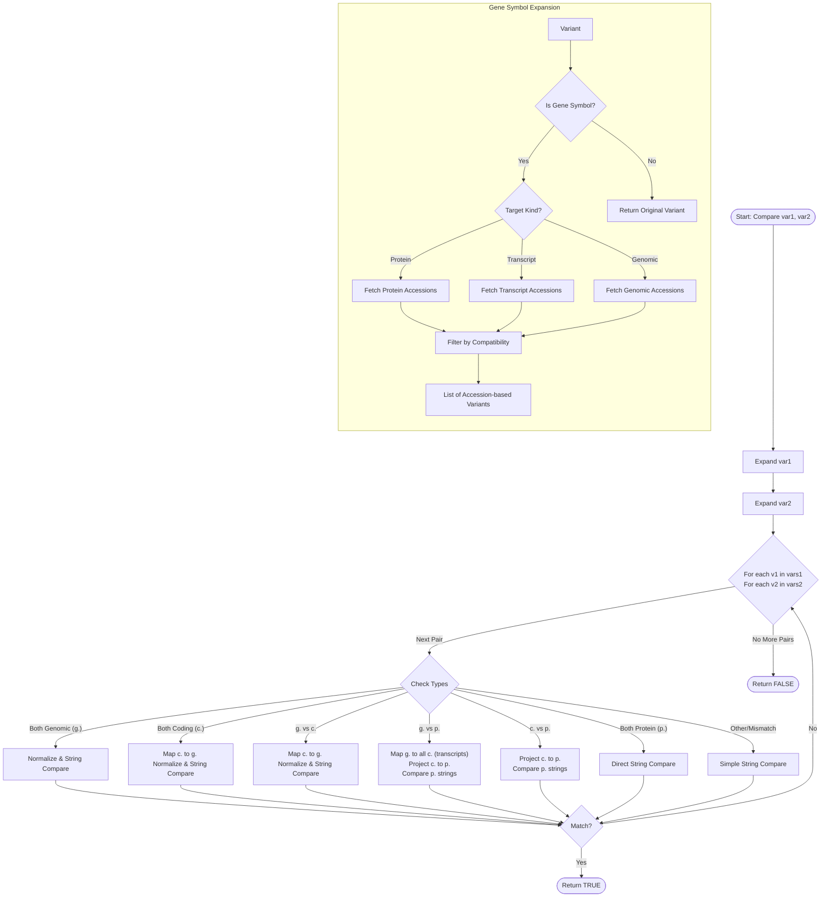

# Variant Equivalence Algorithm

This document outlines the algorithm used by `hgvs-weaver` to determine if two variants are biologically equivalent. The `VariantEquivalence` struct manages this process, handling gene symbol expansion, normalization, and cross-coordinate mapping.

## Overview

The equivalence check proceeds in two main phases:

1. **Gene Symbol Expansion**: If a variant uses a gene symbol (e.g., `BRAF:c.1799T>A`) instead of an accession, it is resolved to all valid accessions for that gene.
2. **Comparison**: All combinations of the expanded variants are compared using strategies specific to their coordinate types.

## Algorithm Flowchart

## Detailed Steps

### 1. Gene Symbol Expansion

Before comparison, each variant is checked to see if it uses a gene symbol (e.g., `BRAF`) via `DataProvider::get_identifier_type`.

- **Smart Selection**: The expansion targets a specific accession type based on the variant's coordinate system:
    - `p.` variants $\rightarrow$ `ProteinAccession`
    - `c.` / `n.` / `r.` variants $\rightarrow$ `TranscriptAccession`
    - `g.` / `m.` variants $\rightarrow$ `GenomicAccession`
- **Compatibility Filter**: Returned accessions are filtered to ensure they match the variant type (e.g., ensuring a `c.` variant doesn't get assigned a protein accession).

### 2. Comparison Strategies

Code: [hgvs-weaver/src/equivalence.rs](../../hgvs-weaver/src/equivalence.rs)

The system now supports granular equivalence levels:

### HGVS Variant Equivalence Examples

| Equivalence Level | Comparison Type | Scenario Description      | Example Variant A | Example Variant B       | Notes                                                                                                       |
| :---------------- | :-------------- | :------------------------ | :---------------- | :---------------------- | :---------------------------------------------------------------------------------------------------------- |
| **`Identity`**    | `c.` vs `c.`    | **Exact Match**           | `c.123A>G`        | `c.123A>G`              | Strings match after basic normalization.                                                                    |
|                   | `g.` vs `c.`    | **Transcript Location**   | `g.5000A>G`       | `c.123A>G`              | `g.` variant projects exactly to the `c.` variant on the transcript.                                        |
|                   | `c.` vs `p.`    | **Predicted Consequence** | `c.123A>G`        | `p.(Glu41Gly)`          | The *predicted* protein consequence of `c.` matches `p.` exactly (including parentheses).                   |
| **`Analogous`**   | `c.` vs `c.`    | **Repeat Shifting**       | `c.4_6del`        | `c.10_12del`            | Deleting first vs third repeat unit results in identical transcript sequence.                               |
|                   | `p.` vs `p.`    | **Insertion Offset**      | `p.Tyr165Ter`     | `p.Ala164_Tyr165insTer` | Different descriptions of the same truncation event.                                                        |
|                   | `c.` vs `p.`    | **Observed vs Predicted** | `c.123A>G`        | `p.Glu41Gly`            | `c.` predicts `p.(Glu41Gly)`; matches observed `p.Glu41Gly` biologically (ignoring prediction brackets).    |
|                   | `g.` vs `g.`    | **Indel Redundancy**      | `g.10_11insA`     | `g.10dup`               | Insertion of `A` after `A` is biologically identical to duplicating `A`.                                    |
| **`Different`**   | `c.` vs `c.`    | **Distinct Edits**        | `c.123A>G`        | `c.123A>T`              | Different nucleotide substitutions.                                                                         |
|                   | `c.` vs `p.`    | **Effect Mismatch**       | `c.123A>G`        | `p.Glu41Val`            | `c.` predicts `p.Glu41Gly`, but `p.` is `Val`.                                                              |
|                   | `c.` vs `p.`    | **Normalization Clash**   | `c.4_6del`        | `p.Gln4del`             | *Known Issue:* Weaver generates `p.Gln4Ter` (Substitution) instead of `p.Gln4del` (Deletion) for this case. |
| **`Unknown`**     | `c.` vs `?`     | **Missing Data**          | `c.123A>G`        | `p.?`                   | Transcript or protein sequence unavailable for projection.                                                  |

#### Genomic vs. Genomic / Coding vs. Coding / NonCoding vs. NonCoding

1. **3'-Most Normalization**: Variants are shifted to their most 3' position.
2. **Strand-Aware Projection**:
   - Variants are projected onto a local sequence window (`±2` bases).
   - **Crucial**: If the variant is on the minus strand, edits (like `insA` or `T>C`) are reverse-complemented before projection onto the genomic reference. This ensures that `c.35_36insT` (minus strand) defines an insertion of `T` on the *transcript*, which corresponds to an insertion of `A` on the *genome*, correctly matching `g.dupA` if the reference is `A`.
3. **Implicit Sequence Filling**: Deletions/Duplications by length are filled with reference sequence.
4. **Unification**: The projected sequences are compared using `analogous_edit::reconcile_projections`.

#### Protein vs. Protein (`p_vs_p_equivalent`)

1. **Residue Unification**:
   - Amino acids are parsed into `ResidueToken`s (e.g., `Known(Ala)`, `Unknown(Xaa, 1)`).
   - Variants are projected onto a window around the edit.
   - Using `UnificationEnv`, ambiguous tokens (`?`, `Xaa`) are unified with specific residues if a consistent mapping exists (e.g., `Xaa` can become `Ala`).
2. **Sequence Identity Check**:
   - Checks if the final protein sequences are identical.
   - Handles localized redundancy (e.g., `Ala2_Ala3dup` vs `Ala3_Ala4dup` in a poly-Ala tract).

#### Cross-Coordinate Comparisons (g. vs c., c. vs p., etc.)

1. **Mapping**: Variants are mapped to a common coordinate system (usually Genomic for NA, Protein for AA).
2. **Projection**: Once mapped, the standard comparison logic (Projection + Unification) is applied.
3. **Transcript Mismatch**: If a `c.` variant implies a transcript sequence that differs from the reference (e.g., `insA` where Ref is `G`), it is flagged as `Different` unless the user explicitly allows mismatches (though `weaver` defaults to strict checks).
